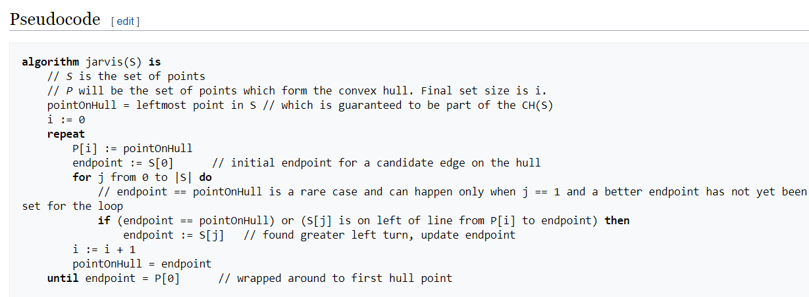
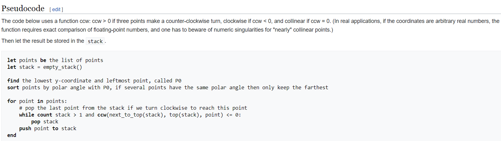
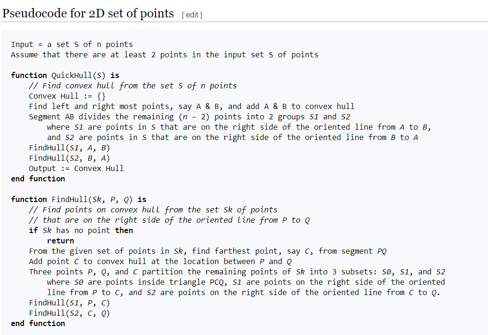

# Doxygen Documentation of Convex Hull Algorithms

 The convex hull algorithms described in the documentation are :
1. **Jarvis March - Gift Wrapping Algorithm : O (n.h) time complexity.**  
2. **QuickHull Algorithm : O (n log n) time complexity.**  
3. **Graham Scan Algorithm : O (n log n) time complexity.**  
  
  
  ## Jarvis March Algorithm :  
  Jarvis March algorithm is used to detect the corner points of a convex hull from a given set of data points.

Starting from a leftmost point of the data set, we keep the points in the convex hull by anti-clockwise rotation. From a current point, we can choose the next point by checking the orientations of those points from the current point. When the angle is largest, the point is chosen. After completing all points, when the next point is the start point, stop the algorithm.  
  
**The functions used in the algorithm are :  
* ##### `Point_2D(double xi,double yi)` :  
Define a 2D-Point using the given input Coordinates.  
* ##### `vector<Point_2D> Jarvis_March_Convex_Hull(vector<Point_2D> P)` :  
Compute the CLoclwise Sorted Convex Hull for the given set of the 2D-Points.  
* ##### `Point_2D findMinX(vector<Point_2D> Pts) ` :  
Finds the Point in the set which has the least X-coordinate.  
* ##### `Point_2D Next_Point_on_Hull(Point_2D curr, vector<Point_2D> Pts)` :  
Finds and returns the next valid , clockwise sorted point in the final Convex Hull.  
* ##### `double Convex_Hull_Perimeter(vector<Point_2D> Convex_Hull)` :  
Returns the perimeter of the hull created by the convex polygon of all the points in the Convex_Hull.  
* ##### `double getDistance(Point_2D p1, Point_2D p2)` :  
Finds the distance between points p1 and p2.  
* ##### `bool NotEqual(Point_2D p1, Point_2D p2)` :  
Checks if the given 2 points p1 and p2 are equal or not.  
* ##### `double isLeftOf(Point_2D p1, Point_2D p2, Point_2D p3)` :  
Finds the cross-product of the points p1, p2, p3 .i.e. Finds out whether p1, p2, p3 make a left turn, or a right turn, or are collinear.  

The Pseudocode of the algorithm works as follows:  
  
  

## Graham Scan Algorithm :  
Graham’s Scan algorithm will find the corner points of the convex hull. In this algorithm, at first, the lowest point is chosen. That point is the starting point of the convex hull. Remaining n-1 vertices are sorted based on the anti-clockwise direction from the start point. If two or more points are forming the same angle, then remove all points of the same angle except the farthest point from start.  
  
  
From the remaining points, push them into the stack. And remove items from stack one by one, when orientation is not anti-clockwise for stack top point, second top point and newly selected point points[i], after checking, insert points[i] into the stack.
  
  
**The functions used in the algorithm are :  
* ##### `static int alignment(Point a, Point b, Point c)` :  
Used to test the alignment of three points a,b,c.  
* ##### `bool operator < (Point other)` :  
An overloaded < operator for comparing the ordering of two points.  
* ##### `std::stack<Point> grahamScan(std::vector<Point> &v) ` :  
Calculates the convex hull of a list of points in 2D. Takes in a list of points and returns a stack of points in the convex hull in clockwise order from the top.  
* ##### `void printGrahamScan(std::stack<Point> &s)` :  
Utility function to display the convex hull.
* ##### `static double squareDistance(Point a, Point b)` :  
Finds the squared distance between points p1 and p2.  
  
  
The Pseudocode of the algorithm works as follows:  
  
  
  
## Quick Hull Algorithm :  
Quickhull is a method of computing the convex hull of a finite set of points in the plane. It uses a divide and conquer approach similar to that of quicksort, from which its name derives. Its average case complexity is considered to be Θ(n * log(n)), whereas in the worst case it takes O(n^2). Quick Hull was published by C. Barber and D. Dobkin in 1995.  
  
The key idea behind QuickHull is that: 
* When a convex Hull H of a set of points S in known, then the convex Hull H1 of the set of points S1, that is S + a new point P, is computed as follows:

* Let P1 and P2 be the closest point to P in the left and right section respectively.  
* Remove line P1 to P2 from convex Hull H.  
* Add lines P1 to P and P to P2 to modified convex hull H to get new convex Hull H1.  

  

**The functions used in the algorithm are :  
* ##### `int QuickHull::findSide(vertex p,vertex x,vertex y)` :  
findSide is used to find the side of a point p with respect to a line segment xy by calculating the determinant of p,x,y.  
* ##### `void QuickHull::quickhull(vertex x,vertex y,int side)` :  
Quickhull is a recursive function used to find the points of the convex hull .  
* ##### `double QuickHull::findDistance(vertex p,vertex x,vertex y)` :  
findDistance is used to use the y=mx+c equation of line xy and find distance of point p by substituting it in the equation.
* ##### `void QuickHull::printPoints()` :  
function to print the set of points.  
* ##### `void QuickHull::findConvexHull()` :  
function to first call the function `quickhull`.  
  

The Pseudocode of the algorithm works as follows:    
  
  

